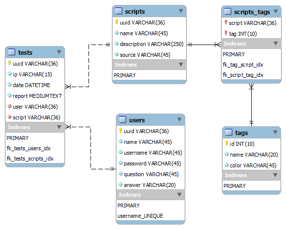

# Data Network Overlock

This is [Data Network Overlock's](https://github.com/DataNetworkOverlock/DNOProject) API built with NodeJS and Typescript that connects to a MySQL database. It's made with hexagonal architecture patterns and the implementations of some of the SOLID principles.

## Pre-requisites

-   [NodeJS](https://nodejs.org/en/)
-   [MySQL Server 5.7.\*](https://dev.mysql.com/downloads/)

## Getting started

-   Clone the repository

```bash
git clone https://github.com/DataNetworkOverlock/dno-api.git
```

-   Install dependencies

```bash
cd dno-api
npm install
```

## Database

Data Network Overlock database has the following structure:



## Environment

-   These are the environmet variables used for connecting with the database

```
DB_HOST = localhost
DB_USER = <mysql-user>
DB_PASSWORd = <mysql-password>
DB_NAME = <database-name>
DB_PORT = <database-port>
PORT = 5000
SECRET = <secret key to generate JWT>
```

## Execution

-   Run

```bash
npm run dev
```

-   Test

> [!NOTE]
> Not yet implement

```bash
npm run test
```

## API Reference

See [more](./REFERENCE.md)

| Method | URL              | Action                         | params                                                        |
| ------ | ---------------- | ------------------------------ | ------------------------------------------------------------- |
| GET    | /users           | get all users                  | [Get users](./REFERENCE.md#get-users)                         |
| POST   | /users           | create new user                | [New user](./REFERENCE.md#new-user)                           |
| DELETE | /users/:uuid     | remove user by `uuid`          | -                                                             |
| GET    | /scripts         | get all scripts                | [Get scripts](./REFERENCE.md#get-scripts)                     |
| POST   | /scripts         | create new script              | [New script](./REFERENCE.md#new-script)                       |
| GET    | /tests           | get all tests                  | [Get tests](./REFERENCE.md#get-tests)                         |
| GET    | /tests/:username | get tests by the selected user | [Get Tests by Username](./REFERENCE.md#get-tests-by-username) |
| POST   | /tests           | create new test                | [New Test](./REFERENCE.md#new-test)                           |
| DELETE | /tests/:uuid     | remove test by `uuid`          | -                                                             |
| POST   | /login           | verify login info              | [Login](./REFERENCE.md#login)                                 |

## Project Structure

| Name                  | Description                                                                                                                                  |
| --------------------- | -------------------------------------------------------------------------------------------------------------------------------------------- |
| index.ts              | Entry point to Express app                                                                                                                   |
| src/domain            | Core of the application. Defines entities, types, interfaces, services and utils. Basically, the business rules.                             |
| src/domain/services   | Helper functions to retrieve data form databases                                                                                             |
| src/domain/utils      | Tools to assist some functionalities like generators                                                                                         |
| src/domain/exceptions | Error handling with custom exceptions                                                                                                        |
| src/application       | It's where business process flows are handled. It defines Use Cases for the app                                                              |
| src/infrastructure    | Layer that access external services like databases. It uses driven and driving adapters to interact between the user and the infrastructure. |
| package.json          | Contains npm dependencies and scripts                                                                                                        |
